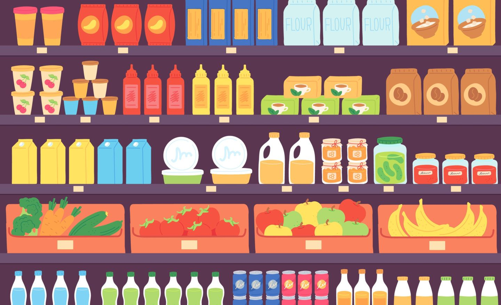
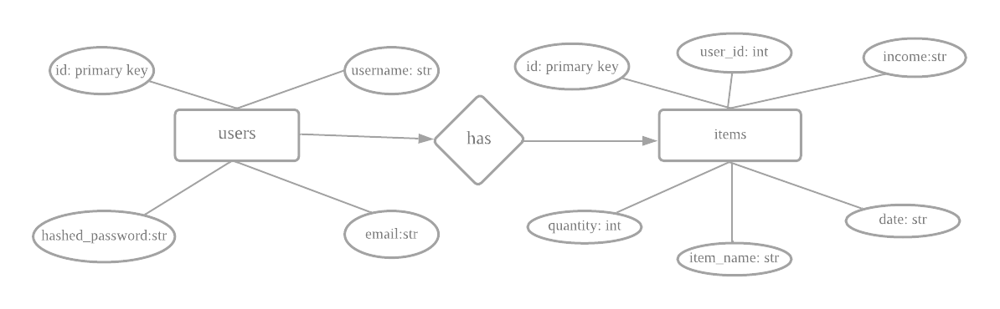
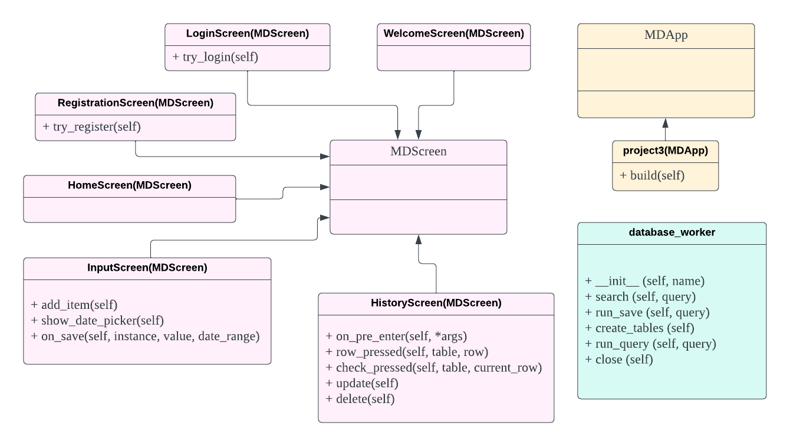

# Unit 3: Campus Konbini App

 Fig (1) shows a picture from coupons.com

# Criteria A: Planning

## Problem definition
My client, UWC ISAK Japan student, Paula Yaniz Macia is part of an entrepreneurship club. She identified a problem of our school being located too far away from the nearest konbini. With Edvards Rokens and Amine Itane by her side, she decided to make basic grocery shop items available to students on campus and made a project called “Campus Konbini”. However, she is facing a major challenge in managing and tracking all the data related to her project such as the date when they sold a product, the name of the product, the amount of product sold, and the profit they have made. The manual data management system for the 'Campus Konbini' project, writing data on paper,  is inefficient and vulnerable to physical damage, leading to data loss and errors. As a result, Paula and her team require a simple application that will store their data in a secure and accessible manner.
## Success criteria

1. The application must have a registration system where the users can register their email, username, and password which will be saved into the database.
2. The application must have a working login system, where all the credentials entered have to match with the database (registered data).
3. The application must encrypt the user's password in the local SQL database.
4. The application must have an input screen that gives the option to log data, view past data, or log out.
5. The user must be able to input all 4 attributes (date, name, quantity, and income of the product sold) into the database via the GUI.
6. The application will allow the user to view all attributes stored in the database.
7. The application must contain a  welcome screen, login screen, registration screen, home screen, screen to enter data, and screen to view the data; in total 6 unique screens.

## Design statement

I will design an application for Paula Yaniz Macia, a UWC ISAK student.  This will be a “Campus Konbini” application and will serve to store data of the sold items in digital format. To maintain security and privacy, the login system will have a hashing technique to secure everyone's password, and all of them will be saved in a local database using SQLite. The program will feature a graphical user interface (GUI) so that users may navigate it with a few mouse clicks. All of this will be written in the Python programming language with KivyMD serving as the GUI builder. The program Pycharm will be used to write and develop all of the code. It will be developed in a one-month period and judged by the success criteria previously stated.

## Rationale for proposed solution
### Why Python?
I have selected Python as my preferred programming language for a variety of reasons. To begin with, Python is the most widely used and well-known programming language worldwide [^1]. This will improve the client's overall experience by boosting the app's compatibility with a wider range of platforms and enabling me to have more access to resources and references. Python programming is what I am personally most comfortable with, therefore not only will everything be streamlined, but the client will also receive the app on time and without any extensions of the due date. Python is clearly the best programming language for this project, as seen by the advantages it provides for both the programmer and the client.

Future developers will be able to enhance and add to the program I have made because Python is claimed to be the most well-known and popular programming language in the entire world [^1]. Clients will also benefit from this since they will be able to obtain applications that are constantly updated with new features and viewpoints from other developers.

### Why KivyMd?

Using KivyMD has a significant advantage in that it enables developers to build applications that are compatible with multiple platforms, including Android, iOS, and Windows. KivyMD's small number of variables makes it highly suitable for co-development, facilitating easy interpretation and extending the application's functionality while saving time and effort [^2]. KivyMD is also the library I am the most familiar with and will help me as a developer to finish my project on time. Compared to other UI development software like Flutter, KivyMD has several advantages, such as a more supportive online community, ease of use, and, most importantly, compatibility with Python, making it the preferred choice for this project [^3].

### Why SQLite?

I opted to use SQLite as the most appropriate database management system for this solution. SQLite is a free database that runs on a single file without the need for an additional server process. It is ideal for my client's requirements as it can efficiently handle large volumes of data [^4]. Unlike IBM db2, it doesn't require lengthy procedural routines and continuously updates the stored content to minimize or eliminate data loss in the event of power failure or system crashes [^5]. This is crucial for my client, who needs fast and easy access to stored data. Additionally, its cross-platform compatibility enables future developers to extend the program to other platforms, providing additional benefits for my client. Compared to other databases, SQLite is the best option for my client due to its reliability, efficiency, cost-effectiveness, and user-friendliness [^4].

### Why is the output through GUI?

The output of the application will be a graphical user interface (GUI) instead of plain text. The reason for this is to fulfill the client's request for an application that not only captures and displays data but also does so through a GUI for ease of use. Keeping in view the client's specifications, I have concluded that a GUI-based output would be the most appropriate

## Works cited
[^1]: Eastwood, Brian. “The 10 Most Popular Programming Languages to Learn in 2021.” Northeastern University Graduate Programs, 13 Feb. 2023, www.northeastern.edu/graduate/blog/most-popular-programming-languages/. 

[^2]: Gupta, Kaustubh. “What Is KivyMD: Creating Android Machine Learning Apps Using KivyMD.” Analytics Vidhya, 6 July 2021, www.analyticsvidhya.com/blog/2021/06/creating-android-ml-app-kivymd/#:~:text=KivyMD%20is%20built%20on%20the. 

[^3]: “Kivy vs Flutter: Learn the Key Differences between Kivy and Flutter.” EDUCBA, 13 June 2022, www.educba.com/kivy-vs-flutter/. 

[^4]: Petros Koulianos. “5 Reasons to Use Sqlite the Tiny Giant for Your next Project.” Medium, The Startup, 9 Aug. 2020, medium.com/swlh/5-reasons-to-use-sqlite-the-tiny-giant-for-your-next-project-a6bc384b2df4. 

[^5]: “SQLite Advantages and Disadvantages - Javatpoint.” Www.javatpoint.com, www.javatpoint.com/sqlite-advantages-and-disadvantages. 

# Criteria B: Design

## System diagram

Fig. 2 This is the system diagram for the proposed solution.

It provides a graphic picture of the system, its parts, and how they work together. The application will function on Python and KivyMD, as was already mentioned. The user will provide the application with a variety of inputs, all of which will be stored in a database using SQLite. The Pycharm program will be used to carry out all of this, and the output will be shown on a screen.

## Wireframe diagram

Fig. 3 This is the wireframe diagram for the application
  
This Wireframe Diagram displays the application's GUI's produced design. All six of the application's screens are displayed, along with the functionality of each button that was intended for use. The user can see which screen will open when they press the button thanks to the arrows that extend from the button to the screen.

## ER Diagram
  

Fig. 4 This is the ER diagram 

This is the ER diagram for the database illustrating the relationship between the items table and users table from the "campuskonbini" database. In the items table, there are 6 different columns including id, user_id, date, item_name, quantity, and income which each column will have the specific data type after the column name. The second table has 4 columns which are username, id, email and password. This diagram also shows that 1 user can have multiple items.

## UML Diagram

Fig. 5 This is UML diagram

This UML diagram for the OOP classes illustrates the classes and methods utilized during the development of the application. It showcases two primary parent classes, namely MDApp and MDScreen. All the classes inherit the methods and attributes of these parent classes, which is demonstrated by the arrows displayed on the diagram.

## Flow diagram
