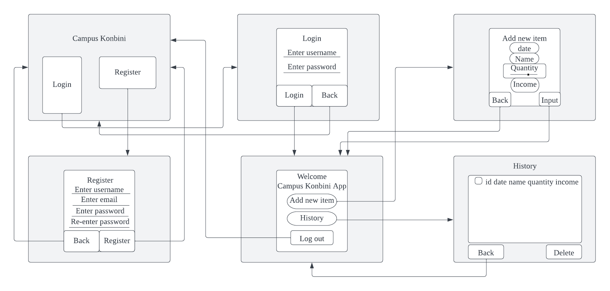
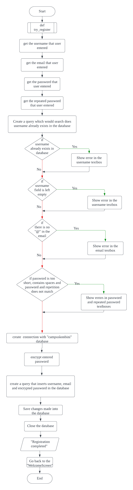
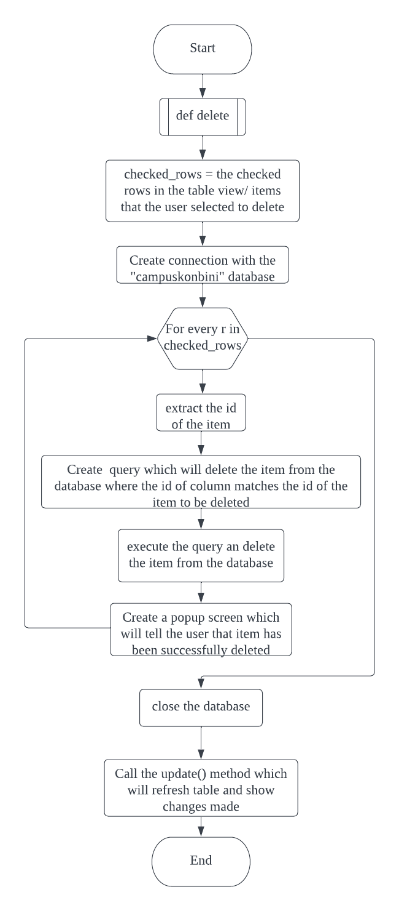
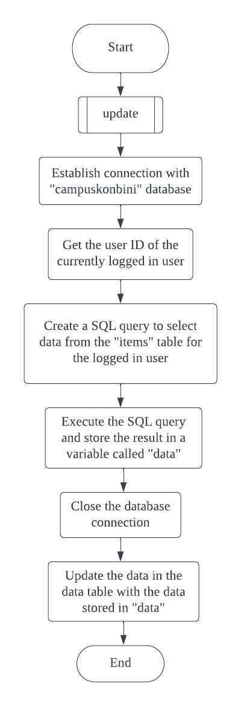
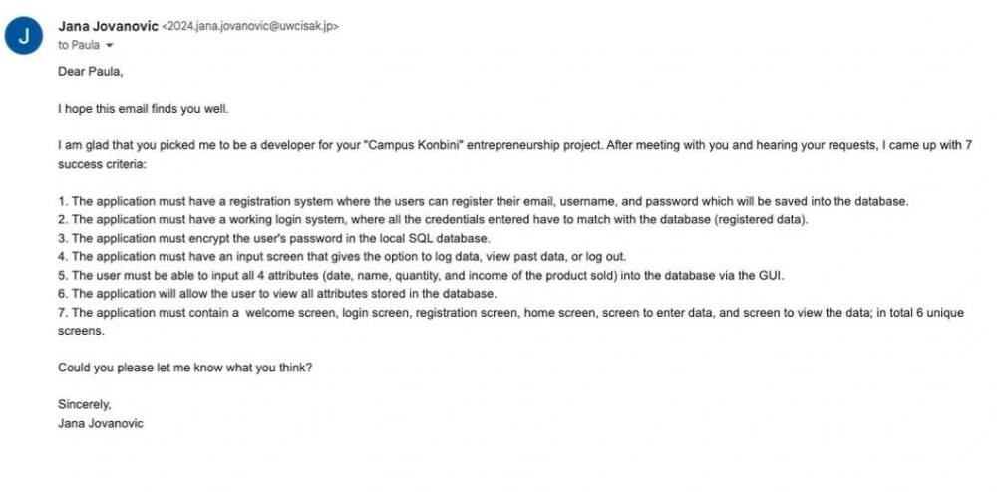
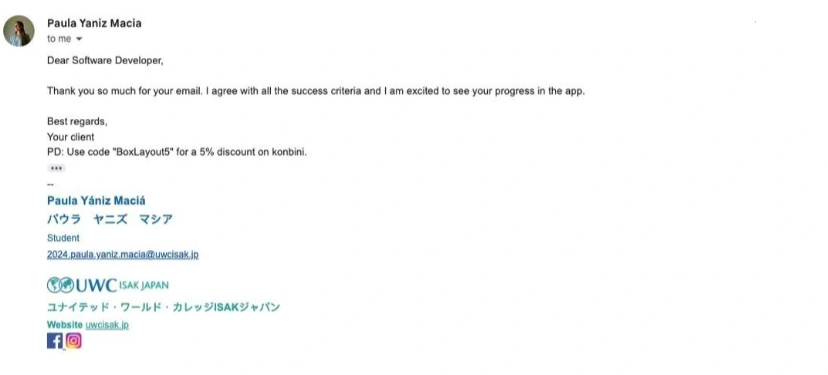

# Unit 3: Campus Konbini App

<sub> Fig (1) shows a picture from coupons.com

# Criteria A: Planning

## Problem definition
My client, UWC ISAK Japan student, Paula Yaniz Macia is part of an entrepreneurship club. She identified a problem of our school being located too far away from the nearest konbini. With Edvards Rokens and Amine Itane by her side, she decided to make basic grocery shop items available to students on campus and made a project called “Campus Konbini”. However, she is facing a major challenge in managing and tracking all the data related to her project such as the date when they sold a product, the name of the product, the amount of product sold, and the profit they have made. The manual data management system for the 'Campus Konbini' project, writing data on paper,  is inefficient and vulnerable to physical damage, leading to data loss and errors. As a result, Paula and her team require a simple application that will store their data in a secure and accessible manner.
## Success criteria

1. The application must have a registration system where the users can register their email, username, and password which will be saved into the database.
2. The application must have a working login system, where all the credentials entered have to match with the database (registered data).
3. The application must encrypt the user's password in the local SQL database.
4. The application must have an input screen that gives the option to log data, view past data, or log out.
5. The user must be able to input all 4 attributes (date, name, quantity, and income of the product sold) into the database via the GUI.
6. The application will allow the user to view all attributes stored in the database.
7. The application must contain a  welcome screen, login screen, registration screen, home screen, screen to enter data, and screen to view the data; in total 6 unique screens.

## Design statement

I will design an application for Paula Yaniz Macia, a UWC ISAK student.  This will be a “Campus Konbini” application and will serve to store data of the sold items in digital format. To maintain security and privacy, the login system will have a hashing technique to secure everyone's password, and all of them will be saved in a local database using SQLite. The program will feature a graphical user interface (GUI) so that users may navigate it with a few mouse clicks. All of this will be written in the Python programming language with KivyMD serving as the GUI builder. The program Pycharm will be used to write and develop all of the code. It will be developed in a one-month period and judged by the success criteria previously stated.

## Rationale for proposed solution
### Why Python?
I have selected Python as my preferred programming language for a variety of reasons. To begin with, Python is the most widely used and well-known programming language worldwide [^1]. This will improve the client's overall experience by boosting the app's compatibility with a wider range of platforms and enabling me to have more access to resources and references. Python programming is what I am personally most comfortable with, therefore not only will everything be streamlined, but the client will also receive the app on time and without any extensions of the due date. Python is clearly the best programming language for this project, as seen by the advantages it provides for both the programmer and the client.

Future developers will be able to enhance and add to the program I have made because Python is claimed to be the most well-known and popular programming language in the entire world [^1]. Clients will also benefit from this since they will be able to obtain applications that are constantly updated with new features and viewpoints from other developers.

### Why KivyMd?

Using KivyMD has a significant advantage in that it enables developers to build applications that are compatible with multiple platforms, including Android, iOS, and Windows. KivyMD's small number of variables makes it highly suitable for co-development, facilitating easy interpretation and extending the application's functionality while saving time and effort [^2]. KivyMD is also the library I am the most familiar with and will help me as a developer to finish my project on time. Compared to other UI development software like Flutter, KivyMD has several advantages, such as a more supportive online community, ease of use, and, most importantly, compatibility with Python, making it the preferred choice for this project [^3].

### Why SQLite?

I opted to use SQLite as the most appropriate database management system for this solution. SQLite is a free database that runs on a single file without the need for an additional server process. It is ideal for my client's requirements as it can efficiently handle large volumes of data [^4]. Unlike IBM db2, it doesn't require lengthy procedural routines and continuously updates the stored content to minimize or eliminate data loss in the event of power failure or system crashes [^5]. This is crucial for my client, who needs fast and easy access to stored data. Additionally, its cross-platform compatibility enables future developers to extend the program to other platforms, providing additional benefits for my client. Compared to other databases, SQLite is the best option for my client due to its reliability, efficiency, cost-effectiveness, and user-friendliness [^4].

### Why is the output through GUI?

The output of the application will be a graphical user interface (GUI) instead of plain text. The reason for this is to fulfill the client's request for an application that not only captures and displays data but also does so through a GUI for ease of use. Keeping in view the client's specifications, I have concluded that a GUI-based output would be the most appropriate

## Works cited
[^1]: Eastwood, Brian. “The 10 Most Popular Programming Languages to Learn in 2021.” Northeastern University Graduate Programs, 13 Feb. 2023, www.northeastern.edu/graduate/blog/most-popular-programming-languages/. 

[^2]: Gupta, Kaustubh. “What Is KivyMD: Creating Android Machine Learning Apps Using KivyMD.” Analytics Vidhya, 6 July 2021, www.analyticsvidhya.com/blog/2021/06/creating-android-ml-app-kivymd/#:~:text=KivyMD%20is%20built%20on%20the. 

[^3]: “Kivy vs Flutter: Learn the Key Differences between Kivy and Flutter.” EDUCBA, 13 June 2022, www.educba.com/kivy-vs-flutter/. 

[^4]: Petros Koulianos. “5 Reasons to Use Sqlite the Tiny Giant for Your next Project.” Medium, The Startup, 9 Aug. 2020, medium.com/swlh/5-reasons-to-use-sqlite-the-tiny-giant-for-your-next-project-a6bc384b2df4. 

[^5]: “SQLite Advantages and Disadvantages - Javatpoint.” Www.javatpoint.com, www.javatpoint.com/sqlite-advantages-and-disadvantages. 

# Criteria B: Design

## System diagram


Fig. 2 This is the system diagram for the proposed solution.

It provides a graphic picture of the system, its parts, and how they work together. The application will function on Python and KivyMD, as was already mentioned. The user will provide the application with a variety of inputs, all of which will be stored in a database using SQLite. The Pycharm program will be used to carry out all of this, and the output will be shown on a screen.

## Wireframe diagram



Fig. 3 This is the wireframe diagram for the application
  
This Wireframe Diagram displays the application's GUI's produced design. All six of the application's screens are displayed, along with the functionality of each button that was intended for use. The user can see which screen will open when they press the button thanks to the arrows that extend from the button to the screen.

## ER Diagram
  


Fig. 4 This is the ER diagram 

This is the ER diagram for the database illustrating the relationship between the items table and users table from the "campuskonbini" database. In the items table, there are 6 different columns including id, user_id, date, item_name, quantity, and income which each column will have the specific data type after the column name. The second table has 4 columns which are username, id, email and password. This diagram also shows that 1 user can have multiple items.

## UML Diagram


Fig. 5 This is UML diagram

This UML diagram for the OOP classes illustrates the classes and methods utilized during the development of the application. It showcases two primary parent classes, namely MDApp and MDScreen. All the classes inherit the methods and attributes of these parent classes, which is demonstrated by the arrows displayed on the diagram.

## Flow diagrams



Fig. 6 This is flow chart for try_register function

Figure shows the flow diagram of the method used for registration of a new user. It validates data entered for username, email, password and repeated password text fields, and if all credential requirements are met, data are stored successfully in the "campuskonbini" database.



Fig. 7 This is flow chart for delete function

Based on the checked rows in a user interface data table, this function deletes items table entries from the "campuskonbini" database. The function retrieves the chosen rows from the data table, extracts the "id" value from each row, and builds a query to remove the matching record from the database. The data table was updated after the selected rows were removed from the database, and a pop-up notice followed to confirm the deletion of the specified row(s).
  

  
Fig. 8 This is flow chart for update function
  
This function serves to update the table displayed in the History Screen. The purpose of this function is to keep the data table in sync with the database so that any changes made to the database are immediately reflected in the data table.

## Test plan

| Description              | Category     | Input                                                                                                                                                 | Expected output                                                                                                                                                                                                                                                                                                                                                                                                                  |
|--------------------------|--------------|-------------------------------------------------------------------------------------------------------------------------------------------------------|----------------------------------------------------------------------------------------------------------------------------------------------------------------------------------------------------------------------------------------------------------------------------------------------------------------------------------------------------------------------------------------------------------------------------------|
| Test registration system | Unit testing | 1. Run project3.py 2. Click the register button on the Welcome Screen 3. Input data on all the fields 4. Click register                               | After clicking the register button, if the user already exists in the database, a error message will appear and let the user know. If any of the fields where the user input data do not meet specific requirements error message will appear. If all the instructions were followed correctly user will be taken back to the Welcome screen, and be able to log in as all the data are now stored in "campuskonbini" database. |
| Test login system        | Unit testing | 1. Run project3.py 2. Click the login button on the Welcome Screen 4. Input data on all the fields 5. Click login                                     | After clicking the log-in button, if the user doesn't exist, a error message will appear letting the user know. If user exists and the password is correct user will be taken to the Home screen                                                                                                                                                                                                                                |
| Test Home screen         | Unit testing | 1. Run project3.py 2. Login 3. Click all the 3 buttons displayed on the Home screen (add a new item, history, log out)                                | After clicking the "Add new item" button user should be taken to the Input screen; History screen if the user clicked the "History" button and Welcome screen if a user clicked "Log out".                                                                                                                                                                                                                                       |
| Test Input screen        | Unit testing | 1. Run project3.py  2. Login 3. Input data on all the 4 fields (date, name of the item, quantity, and the profit made)                                | After clicking "Select Date of Entry" the date picker will be displayed. After clicking input all of the data input should be stored in the database in the "items" table. A pop-up message appears letting the user know that the item was stored successfully                                                                                                                                                                  |
| Test History screen      | Unit testing | 1. Run project3.py 2. Login 3. Press "History" button on the Home Screen                                                                              | After clicking the "History" button, all the data inputted by the user is displayed in the table, the user will not be able to see the data input by another user.                                                                                                                                                                                                                                                               |
| Test delete Item System  | Unit testing | 1. Run project3.py 2. Login  3. Click "History" button  4. Click on checkboxes of the item(s) that the user wants to delete  5. Click "delete" button | A checkmark will show up inside the box when the user selects the checkbox next to the item. The selected item(s) should then be deleted from the table when they click the delete item button.                                                                                                                                                                                                                                  |
| Code review              | Code review  | Check the Project3.py file for any inadequate variable names or repetitive and inefficient programming methods                                        | The user can better grasp how the code works according to the variable names and comment. The code should be simple to understand and easy to follow.                                                                                                                                                                                                                                                                            |

## Record of tasks
  
| Task No | Planned action                                           | Planned outcome                                                                                                              | Time estimate | Target completion | Criteria |
|---------|----------------------------------------------------------|------------------------------------------------------------------------------------------------------------------------------|---------------|-------------------|----------|
| 1       | First meeting with client                                | To understand client problem and requirements                                                                                | 10 minutes    | 09.2.2023         | A        |
| 2       | Write down success criteria                              | To list down the first success criteria                                                                                      | 30 minutes    | 12.2.2023.        | A        |
| 3       | Write problem definition                                 | A clear problem definition of what the client is facing.                                                                     | 20 minutes    | 12.2.2023.        | A        |
| 4       | Write down a design statement for the client             | A clear design statement that suits the need of the client                                                                   | 20 minutes    | 12.2.2023         | A        |
| 5       | Research and write a rationale for the proposed solutio  | A clear justification that suits the client and developer.                                                                   | 45 minutes    | 13.2.2023.        | A        |
| 6       | Meet with the client to discuss the success criteria.    | Receive the final approval to start creating the application                                                                 | 15 minutes    | 14.2.2023.        | A        |
| 7       | Create system diagram                                    | Develop a clear idea of the hardware and software requirements for the proposed solution                                     | 30 minutes    | 15.2.2023.        | B        |
| 8       | Create ER diagram                                        | ER diagram is created for both tables                                                                                        | 20 minutes    | 18.2.2023         | B        |
| 9       | Create Wireframe diagram                                 | A clear and creative wireframe diagram of the GUI                                                                            | 50 minutes    | 18.2.2023.        | B        |
| 10      | Create UML diagram                                       | Have a finsihed UML diagram, an accurate representation of all classes and object in the python code                         | 60 minutes    | 19.2.2023         | B        |
| 11      | Produce Flow diagrams including descriptions             | Flowcharts and a brief explanation for each section of the solution to obtain a clearer understanding of the code's proccess | 2 hours       | 19.2.2023         | B        |
| 12      | Code Welcome screen                                      | Create visually appealing design on the Welcome screen and buttons positioned correctly                                      | 50 minutes    | 21.2.2023.        | C        |
| 13      | Code and create a working registration screen of the app | A working registration screen with python or kivyMD with a GUI                                                               | 3 hours       | 25.2.2023         | C        |
| 14      | Code and create a working log in screen of the app       | A working log in screen with python or kivyMD with a GUI                                                                     | 2 hours       | 26.2.2023.        | C        |
| 15      | Create database                                          | Insert and store inputs of users and items into the database                                                                 | 30 minutes    | 26.2.2023.        | C        |
| 16      | Create Home screen according to the wireframe diagram    | Screen that contains buttons Input, History, Logout                                                                          | 30 minutes    | 28.2.2023.        | C        |
| 17      | Create Input screen                                      | A page that allows the user to enter items into the 'items' table within the database                                        | 4 hours       | 1.3.2023.         | C        |
| 18      | Add MDSlider                                             | Use MDSlider so user can put the number of product sold                                                                      | 1 hour        | 2.3.2023.         | C        |
| 19      | ADD MDDatePicker                                         | Use MDDatePicker so user can select the date of entry                                                                        | 30 minutes    | 2.3.2023.         | C        |
| 20      | Show add item screen to client                           | Making sure that Input screen meet client's requirements                                                                     | 15 minutes    | 4.3.2023.         | A        |
| 21      | Create table in the History screen                       | Creating table which will display data stored in the table                                                                   | 50 minutes    | 5.3.2023.         | C        |
| 22      | Creating delete item function                            | Adding checkboxes to the table and allowing user to select row which will be deleted                                         | 2 hours       | 5.3.2023.         | C        |
| 23      | Working on buttons functionality                         | Making sure that screens are well connected through buttons                                                                  | 30 minutes    | 6.3.2023.         | C        |
| 24      | Finalise program                                         | Fixing errors found, fixing unwanted repetition of the code                                                                  | 3 hours       | 6.3.2023.         | C        |
| 25      | Present application to the client                        | Having a feedback about application from the client                                                                          | 20 minutes    | 6.3.2023.         | C        |
| 26      | Finalize test plans                                      | Write test plan with inputs and expected outputs                                                                             | 45 minutes    | 7.3.2023.         | B        |
| 27      | Finalize program based on the feedback                   | Add improvements to the code based on the clients feedback                                                                   | 4 hours       | 7.3.2023.         | C        |
| 28      | Write criteria C                                         | Add parts of the code and descriptions                                                                                       | 2 hours       | 8.3.2023.         | C        |

  
# Criteria C: Development
  
## Techniques used
 
1. Object orianted programming (OOP)
2. SQLite Database
3. Variables
4. For loops
5. If statements
6. Functions
7. Password hashing
  
## KivyMD UI Code
  
## Screen Manager
  
```.kv
 ScreenManager:
    WelcomeScreen:
        name: "WelcomeScreen"

    LoginScreen:
        name: "LoginScreen"

    RegistrationScreen:
        name: "RegistrationScreen"

    HomeScreen:
        name: "HomeScreen"

    InputScreen:
        name: "InputScreen"

    HistoryScreen:
        name: "HistoryScreen"
```
This KivyMD code is the backbone setup of the GUI. Screen manager offers a quick and easy way to arrange and transition between several program screens. This feature enables users to perform different tasks and access different functionalities without any confusion. By using a screen manager, I as a developer can organize my code into logical sections based on the different screens and functionalities of the application. This makes it easier to maintain, update and debug the code. When creating each screen for “Campus Konbini application”, I followed the similar structure  by defining each screen with a unique name. 
  
## General Screen Setup (background)
  
```.kv
 FitImage:
        source:"blackkombini.jpeg"
    MDCard:
        border_radius: 20
        radius: [15]
        size_hint: 0.5, 0.8
        pos_hint: {"center_x": 0.5, "center_y": 0.5}
        orientation: "vertical"
        md_bg_color:[1,1,1, 0.4] 
```
This Kivy language code block describes the visual design of the "HomeScreen" screen. All the GUI components are arranged underneath the screen that has the corresponding label to create the actual user interface. I used this as the application's default setup for 5 out of 6 screens (except “WelcomeScreen” screen), giving them all the same layout and background image. 
This piece of code contains the background (FitImage) and the semi-transparent rectangle (MDCard) of the GUI. I’ve changed the opacity of MDCard by using line `md_bg_color:[1,1,1,0.4]`. This is the list that represents the RGBA (red, green, blue, alpha) color values of the background color, where the first three values (1, 1, 1) represent the red, green, and blue color channels respectively, and the fourth value (0.4) represents the alpha channel, which controls the opacity of the color. Additionally, I've utilized rounded borders (border radius) from the KivyMD website by  to make it look more visually attractive.
 
## MDFillRoundFlatIconButton
  
```.kv
  MDFillRoundFlatIconButton:
            text: "Add new item"
            pos_hint: {"center_x":0.5,"center_y":0.65}
            md_bg_color:app.theme_cls.primary_light
            size_hint: 0.45,0.07
            on_release:
                root.parent.current = "InputScreen"
```
This piece of code represents a flat button with round shape and filled color.  It is intended to be used in Material Design applications to provide an easy and visually appealing way for users to interact with the app. After comparing different types of buttons, I have decided to use this one along with MDRaisedButton, which is raised button with a rectangular shape and a filled color. Text, position, color, and size are all defined using simple variables. In this scenario, the on release function specifies that the button switches to the RegisterScreen when it is clicked (root.parent.current = "RegisterScreen").
  
## MDTextField 
```.kv
MDTextField:
    id:passwd
    hint_text: "Enter password"
    helper_text_mode: "on_error"
    password: True
    size_hint: .8, .1
    pos_hint: {"center_x":.5}
    icon_left: "lock"
```
The code creates an MDTextField widget that allows users to input text. The MDTextField is defined with an ID of “passwd" and several attributes such as hint_text, helper_text_mode, helper_text, and icon_left. The password attribute is set to True, indicating that the text field is intended for password input. The helper_text_mode attribute is set to "on_error," which displays an error message if the input provided is invalid. Additionally, the use of helper_text_mode highlights algorithm design by providing a specific feedback mechanism for users in the event of an error.
  
## MDLabel
  
```.kv

MDLabel:
    text: "Welcome"
    text_color: "#000000"
    font_style: 'H2'
    halign: 'center'
    size_hint: 1, 0.14
    pos_hint:{"center_x":0.5, "center_y":0.1}

MDLabel:
    id: login_label
    text: "Campus Konbini App"
    font_style: 'H4'
    halign: 'center'
    size_hint: 1,.09
    pos_hint:{"center_x":0.5, "center_y":0.4}

```
This is an MDLabel's KV code. MDLabels are text labels that appear on the screen and act as markers for the user to show them where they are in the program. The user can tell they have accessed the "Campus konbini" application because I used the MDLabel as the headline for my "Homescreen" screen in this instance.
  
## MDSlider
  
```.kv
MDSlider:
    id: quantity
    min: 0
    max: 10
    value: 5
    humb_color_down: app.theme_cls.accent_color
    pos_hint:{"center_x":0.5, "center_y":0.4}
    size_hint: 0.4,0.07
    text: quantity.value
    step:1
    hint_bg_color: "white"
```
  
MDSlider is a customizable slider widget that allows the user to select a value within a specified range by dragging a thumb along a track. I used it in order to allow users to input the number of products sold in a visually interesting and appealing way. Attributes “min“ and “max” in this code indicate to minimum and maximum values of the number of items sold, whereas attribute “value” sets the initial value of the slider to 5. Attribute “step” sets the step size of the slider to 1, meaning that it will only be able to take on integer values between the minimum and maximum values.
  
## Python code
 
### Setting up the file
  
```.py
import sqlite3
from kivymd.app import MDApp
from kivymd.uix.dialog import MDDialog
from kivymd.uix.screen import MDScreen
from kivymd.uix.pickers import MDDatePicker
from kivymd.uix.datatables import MDDataTable
from secure_password import encrypt_password, check_password
```
Many libraries that will be utilized to create the "Campus Konbini" application are imported by this code. The data on the items sold will be stored in a SQLite database, which can be accessed and modified using the sqlite3 library. The user's password is encrypted using the secure password library before being stored in the database to ensure its security. The application's graphical user interface (GUI), which will be user-friendly and simple to use, is created using the KivyMD library.  
  
### Database worker
  
#### Accessing data stored in the database
  
```.py
    def search(self, query):  # Function for searching inside the db
        result = self.cursor.execute(query).fetchall()  # Run a query and fetch the result
        return result  # Return the found result
  ```
This technique, known as search, requires a query parameter as an input. The technique uses a cursor object to conduct the query and the fetchall() method to retrieve all of the results. The outcome is saved in the result variable before being given back to the user. By running a SQL query that is supplied as the query argument, this method can be used to look up records in a database table. Its use enables me to obtain query results across application development domains that are required for my solution and the requirements of my client.
  
## Login system
  
### Criteria 2. The application must have a working login system, where all the credentials entered have to match with the database (registered data).
  
```.py
        def try_login(self):
        uname = self.ids.uname.text
        passwd = self.ids.passwd.text

        db = database_worker("campuskonbini")
        query_2 = f"SELECT username from users"
        user_list = []
        uname_result = db.search(query_2)
        for element in uname_result:
            user_list.append(element[0])
        print(user_list)

        if len(uname)==0:
            self.ids.uname.error = True
            self.ids.uname.helper_text = "This Field requires input"

        elif uname not in user_list:
            self.ids.uname.error = True
            self.ids.uname.helper_text = "User does not exist."


        if not passwd:
            self.ids.passwd.error = True
            self.ids.passwd.helper_text = "This Field requires input"

        print("User tried to login")
        # Get the input username and password and print it
        uname = self.ids.uname.text
        passwd = self.ids.passwd.text
        db = database_worker("campuskonbini")
        query = f"SELECT * from users WHERE username='{uname}'"
        result = db.search(query)
        if len(result) == 1:
            id,email,username,hashed_password = result[0]
            if check_password(passwd, hashed_password):
                self.user_id = id
                self.ids.uname.text = ""
                self.ids.passwd.text = ""
                self.parent.current = "HomeScreen"
                print("Login successful")
                db.close()


```

Here, I developed an algorithm that makes use of If statements to determine whether the user credentials are accurate and connected to any existing users, in response to a request for secure application access from my client. One cannot access or use the application without a username and password that match one of the users in the "campuskonbini" database. If the username doesn't exist in the database, the KivyMD text will change to "User does not exist." and if the password doesn't match the username, the KivyMD text will change to "Password is incorrect".
  
Part of the computational thinking used in this code is an abstraction. The code abstracts away the details of the database interaction by calling the ‘database_worker' function to handle database connections and queries. This allows the login function to focus on the high-level task of validating user input and determining whether the user should be logged in or not.
  
## Registration system
  
### Checking if user already exists
  
```.py
db = database_worker("campuskonbini")
      query_2 = f"SELECT username from users"
      user_list = []
      uname_result = db.search(query_2)
      for element in uname_result:
          user_list.append(element[0])
      print(user_list)
      if uname not in user_list:
    # code ommited for display
      else:
        self.ids.uname.error = True
        self.ids.uname.helper_text = "This user already exists"

```
  
The code is for checking whether a user with a given username already exists in the database. First, a SQL query is constructed to retrieve all usernames from the ‘users’ table. Then, an empty list is created to store the usernames retrieved from the database. Next, the SQL query is executed using the search method of database_worker class which retrieves all usernames from the users table and returns them as a list of tuples. The for loop iterates through the list of tuples and appends the first element (the username) of each tuple to the user_list. Finally, the code checks weather username already exist in the database and if it does displays error message “This user already exists.”

This code can be used to prevent the same person from unintentionally enrolling twice with different passwords or several users from using the same username, which could cause confusion. It guarantees that each user has a distinct username, which will enable effective control and security of data stored in the database.
  
### Hash setup
  
```.py
pwd_config = CryptContext(schemes=["pbkdf2_sha256"],
                          default="pbkdf2_sha256",
                          pbkdf2_sha256__default_rounds=30000
                          )
```
  
This is the setup for the hashing and encryption of the passwords and inserted inputs. With the "from passlib.context import CryptContext" I was able to utilize the library to its fullest extent.
  
```.py
def encrypt_password(user_password):
    """ This function receives the plain text password from the user and returns the hash salted.
    """
    return pwd_config.encrypt(user_password)
```
This function encrypts the password from a standard string to a hashed string. This uses the "from passlib.context import CryptContext" library to encrypt it.
  
## Decrypting the password
  
```.py
def check_password(user_password, hashed):
    return pwd_config.verify(user_password, hashed)
```
  
This function will decrypt the passwords on the database and match it with the inputted password to see if it matches. This uses the "from passlib.context import CryptContext" library to decrypt the passwords from the database.
  
Hashing is the process of employing a mathematical function to transform an input (such as a password) into a fixed-length string of characters. A hash is the resultant string that is specific to the input and cannot be reversed to reveal the original password. As the original password cannot be recovered from the hash, even if the database is stolen, the hash can be used as a secure means to store passwords.

User passwords are protected in this application via hashing before being saved in the database. When a user creates an account or modifies their password, the password is first added to the database's "users" table after being hashed using the "encrypt password" function. Because the users' passwords are saved as hashes, this makes sure that even if the database is compromised, the hackers will be unable to recover the passwords.
  
## Add item
 
### Inserting the query 
 
```.py
db = database_worker("campuskonbini")
        query = f"INSERT into items (user_id,date,item_name,quantity,income) values('{user_id}','{date}', '{item_name}', '{quantity}','{income}')"
        db.run_save(query)
```

In general, entering Python queries is a crucial part of communicating with databases and is necessary for creating reliable data-driven applications. This query enables data to be inserted to a certain database table. The table name and the values to be inserted are specified in the insert query, which is a string.
This is in charge of adding food items to the application's database. The code executes a SQL query using a database worker object to insert data about the item, including the name, date when it was sold, number of items sold, and amount of money made. By developing a method that describes a series of instructions to insert data into the database, I made use of algorithm design. Algorithm design involves identifying the steps needed to solve a problem or complete a task. By utilizing algorithm design, the application can perform create, read, update, and delete operations effectively, providing an efficient tool for managing the data of “Campus Konbini” project.

  
## Date picker
  
```.py
    def show_date_picker(self):
        date_dialog = MDDatePicker()
        date_dialog.bind(on_save=self.on_save)
        date_dialog.open()

    def on_save(self, instance, value, date_range):
        self.selected_date = value
        value = value.strftime("%m/%d/%Y")
        self.ids.date.text = f"{value}"
```
The piece of code above shows how I allowed the user to input date. I decided to use MDDatePicker class, which gives the user access to a graphical date picker widget. When a user chooses a date from the widget, the on save event is launched. An event listener is attached to this event using the bind() method. The second technique, "on save," refreshes the text field displaying the expiration date while also saving the specified date to the database. When the user chooses a date using the MDDatePicker widget, it is called. I have chosen to save date in format 'dd/mm/yyyy'. I believe by using MDDatePicker I have simplified the process of selecting a date and enhanced the user experience of the application.

In order to make the functionality for selecting the date of selling item simpler and easier to use, I employed abstraction in this code. Additionally, it emphasizes how algorithm design and breakdown are used to produce a seamless and effective user experience.
  
## Creating a table
 
```.py
def on_pre_enter(self, *args):

  self.data_table = MDDataTable(
      use_pagination=True,
      size_hint=(0.9, 0.6),
      pos_hint={"center_x": 0.5, "top": 0.75},
      column_data=[
          ("ID", 20),
          ("Date", 20),
          ("Name of the item", 35),
          ("Quantity", 20),
          ("Income", 35)
      ],
      check=True
  )
  self.data_table.bind(on_row_press=self.row_pressed)
  self.data_table.bind(on_check_press=self.check_pressed)
  self.add_widget(self.data_table)
  self.update()
```
In order to display the table, which is a requirement in the success criteria, the size of it on the screen has to be determined. Next, the columns of the table (attributes) has to be displayed. To do so, the name of the attributes along with the number of pixels required is written in the object called "column_data". Then, the values of each attribute in the data table must be displayed in the table on the screen.
  
## Pop-up dialog
  
```.py
  dialog = MDDialog(title="Thank you, item deleted!",
                              text=f"Your item has been successfully deleted.")
```
This code creates a dialog box using KivyMD to notify the user that an item has been successfully deleted from the database. It takes the item ID as input and displays it in the dialog box. This code is reusable in different parts of the application where a similar confirmation dialog box is needed
  
## Deleting a row from the table
  
```.py
     def delete(self):
        # Function to delete checked rows in the table
        checked_rows = self.data_table.get_row_checks()  # Get the checked rows
        # delete
        db = database_worker("campuskonbini")
        for r in checked_rows:
            item_id = r[0]  # use item_id instead of id
            query = f"delete from items where id= {item_id}"  # use item_id instead of id
            db.run_save(query)
            # Create and open the alert dialog to confirm item has been deleted
            dialog = MDDialog(title="Thank you, item deleted!",
                              text=f"Your item has been successfully deleted.")
            dialog.open()
        db.close()
        self.update()
  ```
The code above demonstrates how to remove checked rows from a database table. The get row checks() method is used in the code to access the checked rows, and a loop and a delete query are used to delete them. In order to warn the user that the item has been destroyed, the code also makes use of the MDDialog method. Other parts of the code use this structure to display pop-up dialogs.
  
# Criteria D: Functionality
  
## Video showing the functionality of the appliction
  
https://drive.google.com/drive/u/0/folders/1K2QhjuonyezkKfoB4IXg2fWf1Mn0V1kK
  
# Appendix
  
## Clients approval of success criteria




